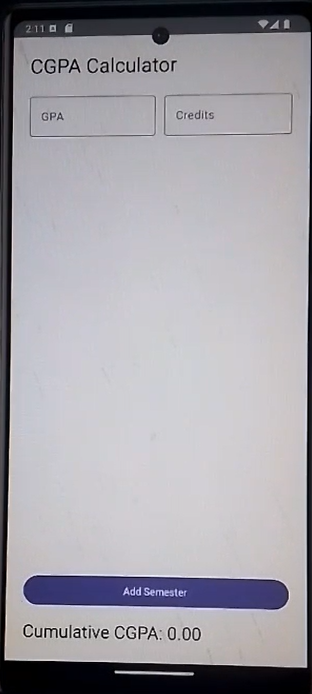

# 📊 CGPA Calculator (Android App)

A simple **CGPA Calculator** built using **Kotlin** and **Jetpack Compose**.  
This app allows students to calculate their **Cumulative GPA** by entering the GPA and credit hours for each semester.  
Perfect for quickly tracking academic progress.

---

## ✨ Features
- 📅 Add multiple semesters dynamically
- 📝 Enter GPA and Credit Hours for each semester
- ⚡ Instant CGPA calculation
- 📱 Clean and responsive UI with Material 3 design

---

## 📷 Screenshots

 

---

## 🛠️ Tech Stack
- **Kotlin**
- **Jetpack Compose**
- **Android Studio**

---

